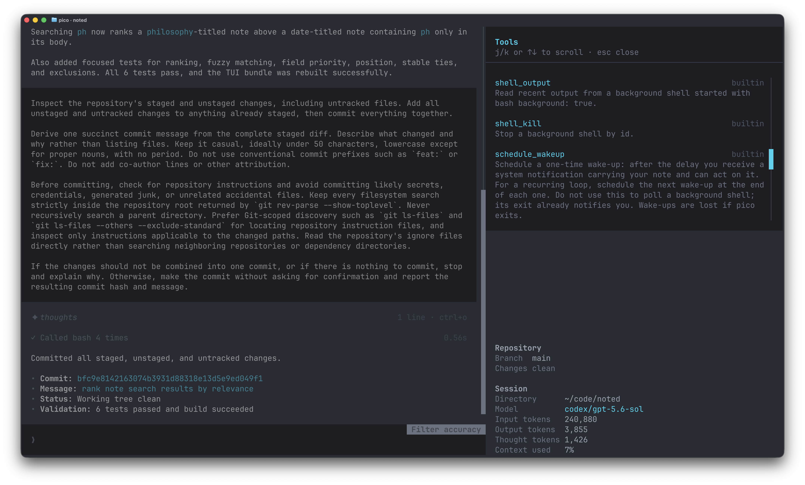

# pico


A coding agent that runs in your terminal. Rendering is [@trendr/core](https://github.com/nvms/trendr), model access is [@prsm/ai](https://github.com/prsmjs/ai).



<p align="center">
  
</p>

## Install

```
npm i -g picocode
```

Requires node 24 or newer and ripgrep. Set at least one provider key in your environment: `GEMINI_API_KEY`, `ANTHROPIC_API_KEY`, `OPENAI_API_KEY`, or `XAI_API_KEY`. Alternatively, use `/connect` in pico to sign in with your ChatGPT subscription and access Codex models. Models are offered based on the credentials available.

## Use

Run `pico` in a project directory. Type `/` to browse commands, or run `/help` for the full reference.

Sessions are stored under `~/.pico` as jsonl event logs. AGENTS.md files are read automatically from the working directory up to the git root, and lazily from subdirectories as the agent touches them. User-defined prompt templates live in `~/.pico/commands` and `.pico/commands`, skills in `~/.pico/skills` and `.pico/skills`.

## Obligatory feature list

- Multi-provider support
- ChatGPT/Codex subscription support through Codex OAuth
- Headless mode with text, JSON, and JSONL output
- Background shells, with a management UI
- Parallel background agents, with a management UI
- Full MCP support
- Project and global memories with on-demand recall and management
- Fast session, project, model, prompt, and file pickers
- Scheduled wake-ups and recurring agent tasks
- Skills and commands
- Image attachments (drag and drop or via file picker)
- Per-project config for memories, commands, skills, tools, and MCP servers

And quite a bit more, actually.

## Tips

Pico can extend itself. Describe what you want and whether it should be available globally or only in the current project.

- Ask Pico to create a skill for you
- Ask Pico to create a command for you
- Ask Pico to create a tool for itself
