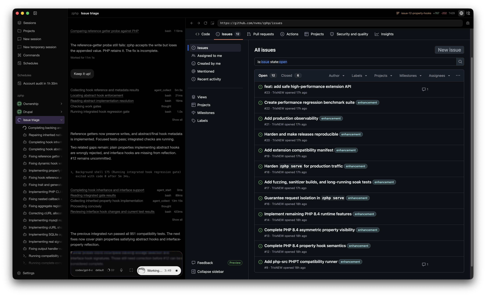

# Pico

A desktop coding agent for macOS.

[Website](https://nvms.github.io/pico/) | [Download for Mac](https://github.com/nvms/pico-releases/releases/latest)



This repository contains Pico's [agent runtime](packages/core) and website. The terminal client lives in `packages/pico`.

## Terminal client installation

```sh
npm install --global picocode
```

### Shell command generation

`pico --shell "zip the images in this folder"` prints one command without running it. To bind Ctrl-] in zsh, add this line to `.zshrc`:

```zsh
source "${commands[pico]:A:h:h}/integrations/pico.zsh"
```

Choose the Shell model in Pico's `/config` screen. `--model` overrides it for one request.

The terminal client's local dictation requires macOS 14 or newer on Apple Silicon. macOS asks for microphone access on first use, and FluidAudio downloads the Parakeet speech models to the user's cache on first use.

In the composer, Ctrl+G starts recording, Enter stops and inserts the transcript at the cursor, and Escape cancels. Dictation never sends a message automatically. The helper stays loaded between recordings and does not require the desktop app.

For a source checkout on macOS, run `make helper` and `make build` before starting the terminal client.
