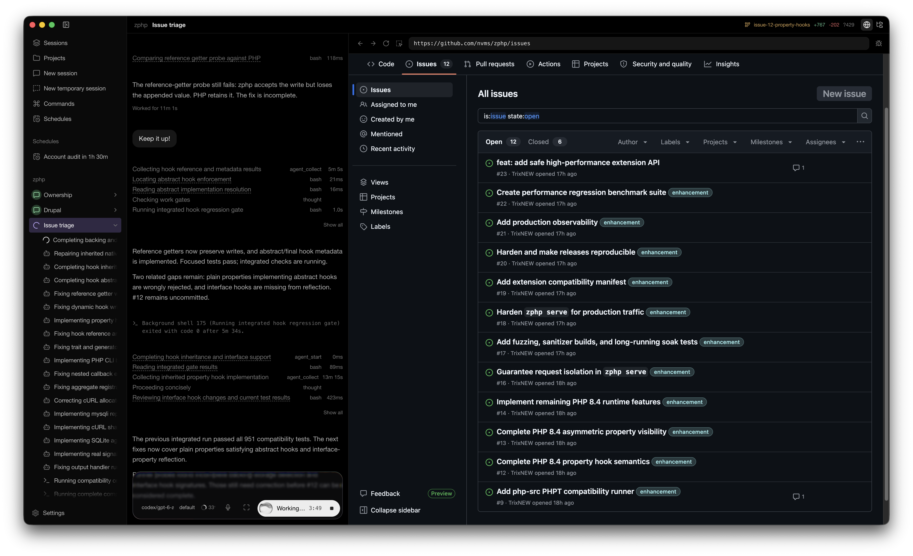

# Pico

A desktop coding agent for macOS.

[Website](https://nvms.github.io/pico/) | [Download for Mac](https://github.com/nvms/pico-releases/releases/latest)



This repository contains Pico's [agent runtime](packages/core) and website. The terminal client lives in `packages/pico`.

## Terminal client installation

```sh
npm install --global picocode
```

### Session messaging

In an interactive session, `/rename foo` enables local peer messaging. Only explicitly named, connected sessions can discover and message one another, across projects under the same local user account. The agent uses `peer_list` and `peer_send`; replies arrive automatically. Messages sent and received appear in full as distinct colored transcript entries.

Names are unique among connected sessions. A conflicting rename leaves the current name unchanged; a resumed session with a conflicting name stays disconnected until renamed. `/rename` without a name disconnects, and `/fork` copies the conversation without its custom name. Messages received during a turn wait until that turn finishes. `peer_send` accepts `urgent: true` to process a message after the next tool call instead; urgent messages still respect pause. Interrupting pauses automatic peer responses until you send another message. Exiting disconnects; offline delivery is not supported. A delivery receipt confirms persistence, not task completion. A timed-out send has unknown delivery status and is not automatically retried. Peer input is labeled as collaborator input, not user or system instructions. Socket access is restricted to the local operating-system account; it does not isolate mutually untrusted processes running under that same account. Unsaved ephemeral sessions cannot enable messaging.

### Codex Fast mode

For Codex subscription models that advertise Fast support, `/speed` selects Standard or Fast independently of thinking effort. `/speed fast` and `/speed standard` apply directly. In the picker, Enter applies to the session; Ctrl+S also saves the default for that model. Session speed survives resume and fork.

Fast requests use `priority` and consume included subscription usage at 2.5x the Standard rate. The Fast label shows the requested setting, not a guarantee of delivered speed. Background workers and deliberation participants remain Standard. `--speed standard|fast` is also available for interactive, headless, and shell requests; shell requests use Standard unless explicitly overridden.

### Shell command generation

`pico --shell "zip the images in this folder"` prints one command without running it. To bind Ctrl-] in zsh, add this line to `.zshrc`:

```zsh
source "${commands[pico]:A:h:h}/integrations/pico.zsh"
```

Choose the Shell model in Pico's `/config` screen. `--model` overrides it for one request.

The terminal client's local dictation requires macOS 14 or newer on Apple Silicon. macOS asks for microphone access on first use, and FluidAudio downloads the Parakeet speech models to the user's cache on first use.

In the composer, Ctrl+G starts recording, Enter stops and inserts the transcript at the cursor, and Escape cancels. Dictation never sends a message automatically. The helper stays loaded between recordings and does not require the desktop app.

For a source checkout on macOS, run `make helper` and `make build` before starting the terminal client.
